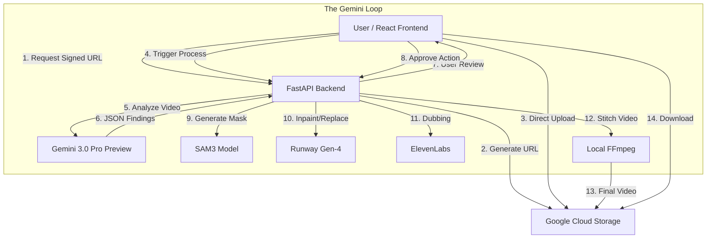

# VidMod: The Autonomous Video Compliance Agent

<div align="center">


[](https://deepmind.google/technologies/gemini/)
[](https://www.python.org/)
[](https://fastapi.tiangolo.com/)
[](https://reactjs.org/)
[](https://cloud.google.com/)
[](https://runwayml.com/)
[](https://ffmpeg.org/)

<br />

**Entering the Action Era: Automated Video Compliance & Remediation**

</div>

---

## The Vision: Entering the Action Era

We built **VidMod** to answer a single question: *What happens when you give an AI model the ability to not just watch a video, but to edit it?*

In the world of media, compliance is a bottleneck. Every minute of content uploaded to platforms like YouTube, TikTok, or Netflix requires rigorous checking for brand safety, profanity, and regulatory compliance. Today, this is done by armies of human moderators or fragile, single-purpose computer vision models.

**VidMod is different.** It is an **autonomous agent** built on the **Gemini 3.0** family. It doesn't just flag violations; it orchestrates a complex, multi-step remediation process to fix them. It acts as a **Director, Editor, and Compliance Officer all in one**, powered by the reasoning capabilities of Gemini 3 Pro and the speed of Gemini 3 Flash.

---

##  System Architecture

VidMod operates on a cloud-native, event-driven architecture designed for high-throughput video processing.



---

## Why Gemini 3? The Brain Behind the Operation

VidMod is not a wrapper. It is a system architected around Gemini 3's unique capabilities. This project would have been impossible with previous generation models.

### 1. Native Video Understanding (Gemini 3 Pro)
Traditional video AI relies on "sampling"—extracting 1 frame every second and sending it to an image model. This loses time, context, and cause-and-effect.

VidMod leverages Gemini 3 Pro's **native video understanding**. We upload the entire video file to the model's 1M+ token context window. This allows Gemini to:
*   **Understand Action**: Distinguish between "holding a bottle" vs. "drinking from a bottle."
*   **Track Context**: Know that a scene is a "historical reenactment" (allowed) vs. "glamorization of violence" (violation).
*   **Temporal Consistency**: Recognize that an object appearing at 0:05 is the same one at 0:15, even if the angle changes.

### 2. Audio-Visual Reasoning
Gemini 3 doesn't just see; it hears. By processing video and audio together, **Gemini 3 Flash** can detect profanity with millisecond precision and, crucially, understand the intent behind the words. A friendly "shut up" is ignored; an aggressive slur is flagged for replacement.

### 3. Policy Injection & Reasoning
We don't hard-code rules. We inject complex, real-world policy documents (e.g., "broadcast standards for daytime TV" or "platform usage guidelines") directly into Gemini's context. The model acts as a reasoning engine, citing specific policy clauses for every decision it makes.

---

## Extensive Engineering: The "Gemini Loop"

We built a robust, event-driven architecture to turn Gemini's reasoning into reality. The system supports five distinct remediation actions, each powered by a specialized engineering pipeline.

### Feature 1: Blur
For privacy protection (faces, license plates), precision is paramount. A bounding box is not enough for moving video.
*   **Implementation**: When Gemini flags an object, we trigger **SAM3 (Segment Anything Model 3)**.
*   **Mechanism**: We feed the frame and the object prompt to SAM3, which generates a high-fidelity segmentation mask. This mask is tracked across frames to ensure the blur stays locked to the subject, even as they move or turn.

### Feature 2: Pixelate
Similar to blur, but used for explicit content or stylistic censorship.
*   **Implementation**: We utilize the same SAM3-driven masking pipeline but apply a mosaic filter via **FFmpeg**.
*   **Mechanism**: The block size of the pixelation is dynamically calculated based on the resolution of the video to ensure illegibility without destroying the surrounding visual context.

### Feature 3: Replace (Generative Inpainting)
This is where VidMod acts as a **Creative Autopilot**. Instead of masking an object, we replace it entirely.
*   **Implementation**: We use **Generative Video-to-Video** technology (Runway Gen-4).
*   **Mechanism**:
    1.  **Prompt Engineering**: Gemini 3 Pro analyzes the scene's lighting, depth, and style, then writes a detailed prompt.
    2.  **Reference Generation**: To ensure the replacement object (e.g., a specific brand-safe soda can) looks perfect, we use Gemini 3 Pro's native image generation to create a photorealistic reference image.
    3.  **Synthesis**: We dispatch the prompt, the reference image, and the video clip to the generation engine, which synthesizes a replacement that respects the original object's motion and physics.

### Feature 4: Dubbing (Audio Replacement)
Replacing a spoken word without re-recording the actor is one of the hardest problems in AV engineering.
*   **Implementation**: Custom Audio Separator pipeline using **Demucs**.
*   **Mechanism**:
    *   **Separation**: We split the audio into four stems: Vocals, Drums, Bass, and Other.
    *   **Voice Cloning**: We clone the speaker's voice using a clean sample found elsewhere in the video.
    *   **Synthesis**: We generate the "safe" word (chosen by Gemini) in the actor's voice via **ElevenLabs**.
    *   **Muting & Recombination**: We mute only the specific timestamp in the Vocal stem and mix the new word with the persistent background stems. This ensures background music doesn't "dip" when the word is changed.

### Feature 5: Beep
The classic censor.
*   **Implementation**: Precision **FFmpeg** audio filtering.
*   **Mechanism**: We generate a 1000Hz sine wave matching the exact duration of the profanity, zero out the original audio, and overlay the beep with zero leakage.

### Intelligent Orchestration (The Marathon Agent)
VidMod is designed for long-running, complex tasks.
*   **State Persistence**: The pipeline maintains a job state machine that survives server restarts.
*   **Self-Healing**: Automatic retries with exponential backoff for external APIs.
*   **Result Verification**: Gemini maintains "Thought Signatures"—logically explaining why it chose a specific action (e.g., *"Replacing 'beer' with 'soda' because policy 4.2 prohibits alcohol in kid-rated content"*).

---

## The Future: Autonomous Media with Gemini Veo

VidMod proves that Gemini 3 is more than a chatbot—it's an infrastructure layer for the next generation of media tools. We are moving from a world where humans edit content to a world where *humans direct agents to edit content for them*.

**Looking Ahead: Gemini Veo**
While we currently orchestrate external video models, the future of VidMod lies with **Gemini Veo**. As Veo's native video-to-video inpainting capabilities mature, we will replace our entire external generation stack with native Gemini video generation. This will unify the entire pipeline—Analysis (Pro), Audio (Flash), and Generation (Veo)—under a single, multimodal model family.

---

## API Reference

| Endpoint | Method | Description |
|----------|--------|-------------|
| `/api/upload-url` | `GET` | Generates a specific GCS Signed URL for large file uploads. |
| `/api/process-upload` | `POST` | Triggers the analysis pipeline after client-side upload completes. |
| `/api/analyze-video/{job_id}` | `POST` | Starts the Gemini 3.0 analysis job (detects violations). |
| `/api/apply-edit/{job_id}` | `POST` | Applies a specific edit (Blur, Pixelate, Replace) to a finding. |
| `/api/preview/{job_id}/frame/{idx}` | `GET` | Retrieves a specific video frame for UI preview. |
| `/api/download/{job_id}` | `GET` | Downloads the final processed video. |

---

## Deployment Guide

VidMod is cloud-native and ready for production.

### Backend (Google Cloud Run)
The backend is stateless and containerized.
```bash
# Deploy to Cloud Run
gcloud run deploy vidmod-backend \
  --source . \
  --platform managed \
  --region us-central1 \
  --allow-unauthenticated \
  --port 8080 \
  --env-vars-file env.yaml \
  --project vidmod-2025 \
  --min-instances 1 \
  --session-affinity
```
*Note: Session affinity is enabled to ensure job state consistency during multi-step processing.*

### Frontend (Firebase Hosting)
The frontend is a static React SPI deployed to the edge.
```bash
cd frontend
npm run build
firebase deploy --only hosting
```

---

## Quick Start (Local)

### Prerequisites
*   **Python 3.10+**
*   **Node.js 18+** & npm
*   **FFmpeg**: Must be available in system `PATH`.
*   **Google Cloud Account**: Storage Bucket & Service Account (Token Creator role).

### 1. Backend Setup
```bash
git clone https://github.com/gana36/VidMod.git
cd VidMod

# Create & Activate Virtual Env
python -m venv venv
venv\Scripts\activate  # Windows
# source venv/bin/activate # Mac/Linux

# Install Dependencies
pip install -r requirements.txt

# Configure Environment
cp .env.example .env
# ⚠️ Populate your .env with API keys!
```

### 2. Frontend Setup
```bash
cd frontend
npm install
npm run dev
```

### 3. Access the Agent
Open `http://localhost:5173` to start the VidMod agent.

---

## 📂 Project Structure

```text
VidMod/
├── app/                 # FastAPI Backend
│   ├── main.py          # Entry Point
│   ├── routers/         # API Endpoints
│   └── services/        # Business Logic
├── core/                # Core AI Engines
│   ├── gemini_video_analyzer.py  # Gemini 3.0 Analysis
│   ├── runway_engine.py          # Gen-4 Wrapper
│   └── gcs_uploader.py           # Cloud Storage
├── frontend/            # React Frontend
│   └── src/components/  # UI Components
├── uploads/             # Local Temp Storage
└── requirements.txt     # Python Dependencies
```

---

## Troubleshooting

### Common Errors

**400 Bad Request (Can not finalize upload)**
> This occurs when the **client-side upload** is interrupted. It usually means the network connection dropped between your browser and Google Cloud Storage.
> *Fix*: Refresh the page and try uploading again.

**500 Analysis Failed (Cloud Run)**
> If you see this in production, it likely means the server tried to write to a read-only directory.
> *Fix*: Ensure `env.yaml` sets `UPLOAD_DIR`, `FRAMES_DIR`, and `OUTPUT_DIR` to `/tmp/...`. Use the provided deployment command which includes this fix.

**Asset duration must be at least 1 seconds (Runway Error)**
> VidMod has **Smart Clipping** built-in. If your selected violation is less than 1 second, the backend automatically expands the clip range to meet the API requirement.

---

## Contributing

VidMod is open for contributions.
1.  Fork the Project
2.  Create your Feature Branch (`git checkout -b feature/AmazingFeature`)
3.  Commit your Changes (`git commit -m 'Add some AmazingFeature'`)
4.  Push to the Branch (`git push origin feature/AmazingFeature`)
5.  Open a Pull Request

---

MIT License © 2026 VidMod
